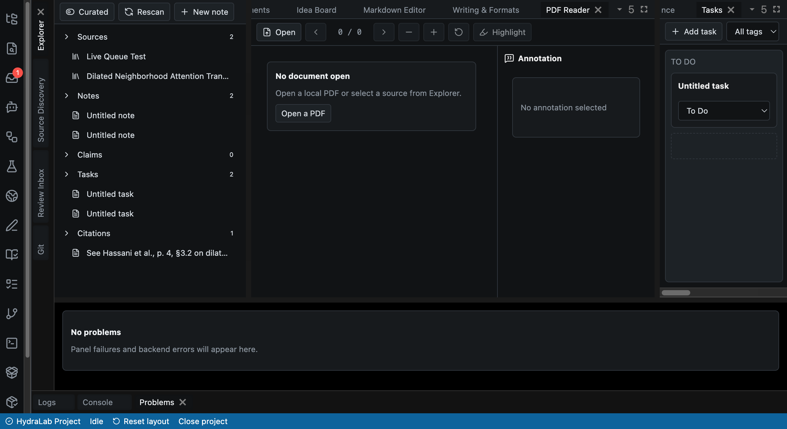

<h1 align="center">HydraLab</h1>

<p align="center">
  <strong>An offline-first research workbench — read, annotate, cite, write, and run research agents, entirely on your own machine.</strong>
</p>

<p align="center">
  
  
  
  
  
  
</p>

<p align="center">
  
</p>

HydraLab is a local-first, co-scientist-grade research environment. You open a project folder and everything a research workflow needs lives inside it: papers, annotations, notes, citations, claims, evidence links, saved chats, tasks, drafts, and orchestrated agent runs — all backed by readable files and a per-project SQLite database on your disk. Your data never leaves your machine without an explicit action from you.

It is not a fork of VS Code, Theia, Obsidian, Zotero, or any co-scientist project. HydraLab builds on proven open-source libraries and adapts their best ideas through its own architecture and contracts.

## Why HydraLab

Most research tools make you choose: a reference manager *or* an editor *or* a chat window *or* an agent framework — each with its own silo, and most of them phoning home. HydraLab is one workbench where those pieces share a single local data model, and where the trust boundary is drawn in your favor:

- **Local and private by default.** Papers, notes, indexes, and chats live on your machine. An enforced offline-only mode hard-blocks network egress entirely. No telemetry, ever.
- **Honest by construction.** Retrieval is extractive: it quotes indexed passages verbatim with exact locators (page, section, character offset) and will never fabricate a citation it cannot ground.
- **Agents behind gates, not hype.** Assistant recipes and closed-loop autonomy exist — but every run is staged, traceable, risk-classified, and routed through approvals, a Review Inbox, and an append-only audit ledger.
- **A real workbench, not a demo.** Every panel in the dockable workspace is wired to a live backend. Reading, annotating, citing, writing, chatting, searching, and organizing happen in one place, against one project.

## Features

### The workbench

- **VS Code–style dockable workspace** (FlexLayout): drag, split, close, and rearrange panels; named layouts persist per project; a command palette drives keyboard-first navigation.
- **Error-isolated panels** — a crash in one panel never takes down the workspace.
- **CodeMirror 6 Markdown editor** with wikilinks, backlinks, callouts, and live preview.
- **PDF.js reader with a research annotation layer**: text-layer selection highlights are stored in normalized page coordinates, so annotations survive re-render, zoom, and window resizes.

### Research intelligence

- **Source discovery** across scholarly APIs — OpenAlex, Crossref, arXiv, and more.
- **Document ingestion** via Docling plus a permissive light extractor, fed through an async ingestion queue into a local search index.
- **Grounded, extractive retrieval** that returns passages with exact locators (page, section, char offset) and never invents a reference.
- **A citations / claims / evidence graph**: BibTeX, CSL-JSON, and RIS import & export; APA and IEEE rendering; confidence-based duplicate detection; and source merging with referential-integrity repair.
- **A knowledge graph** connecting notes, sources, claims, and tasks across the project.

### Assistant & agents

- **Per-project named chats** with bring-your-own-key providers (OpenAI, OpenRouter) and a token budget.
- **MCP tool support** (HTTP transport) so the assistant can operate real project tooling.
- **Orchestrated research recipes**: literature review, paper critique with related-work analysis, and idea generation with ranking.
- **Every agent run is staged and traceable**, gated by approvals and a Review Inbox — nothing lands in your project without your sign-off.
- **A skills registry** and a project-local assistant context file (`HYDRA.md`).

### Autonomy, done responsibly

- **Closed-loop autonomy layer** with policy gates, a risk classifier, human-in-the-loop safety checkpoints, and an append-only audit ledger.
- **Sandboxed experiment execution** and a reproducibility & evaluation ledger.
- **Real-time collaborative editing** (Yjs) with a durable, replayable update log.
- **Responsive mobile/tablet layouts** and a Tauri desktop shell.

## Tech stack

| Layer     | Stack |
| --------- | ----- |
| Frontend  | React 19 · TypeScript · Vite · FlexLayout · CodeMirror 6 · PDF.js |
| Backend   | Python 3.11+ · FastAPI · SQLModel · async SQLite (aiosqlite) · Alembic |
| Storage   | Per-project SQLite + readable project files; secrets in the OS keychain |
| Desktop   | Tauri v2 |
| Extension | Chrome MV3 |
| Tooling   | JS managed by [Bun](https://bun.sh), Python by [uv](https://docs.astral.sh/uv/) |

## Getting started

### Homebrew (recommended)

```bash
brew install M1Vj/hydralab/hydralab
hydralab --project-root /path/to/your/research-project
```

The `hydralab` command starts the local backend and serves the bundled web UI; it prints a `http://127.0.0.1:<port>` URL — open it in your browser. (The first install compiles a few native dependencies, so it can take a few minutes.)

### From source (for development)

**Prerequisites:** macOS (Apple Silicon or Intel), Python 3.11+ with [`uv`](https://docs.astral.sh/uv/), and [Bun](https://bun.sh) 1.x. *(Optional: a Rust toolchain for the Tauri desktop shell.)*

```bash
git clone https://github.com/M1Vj/HydraLab.git
cd HydraLab

uv sync        # backend (Python) environment
bun install    # frontend workspace
```

Then run the backend and frontend, each in its own terminal:

```bash
# 1) Backend — binds 127.0.0.1, auto-selects a port in 8765–8799
cd backend
uv run python -m hydra.serve --project-root /path/to/your/research-project
```

```bash
# 2) Frontend — Vite dev server on http://127.0.0.1:5173
bun run dev
```

Then open <http://127.0.0.1:5173>.

*(optional)* To enable the browser-automation feature:

```bash
uv sync --extra browser
uv run playwright install chromium
```

### Development

```bash
uv run --project backend pytest backend/tests -q   # backend test suite
bun test apps/web/src                              # web unit tests
bun run typecheck                                  # TypeScript type check
bun run build                                      # production frontend build
```

The repository runs a clean CI pipeline on macOS and carries a large test suite spanning the backend and the web app; the four commands above are the local gate for every change.

## Privacy & trust

HydraLab treats privacy as an architectural property, not a settings page.

- **Offline-first, with teeth.** All indexing, reading, and storage happen locally. The enforced offline-only mode hard-blocks network egress — it is not a soft toggle.
- **Every byte of egress is consent-gated.** Provider API calls, source downloads, and browser-context sharing each require an explicit action. Nothing is sent in the background.
- **Untrusted content is data, never instructions.** Page content, PDFs, and imported documents can never silently trigger a fetch or a write — a deliberate defense against prompt-injection through documents you merely read.
- **Secrets live in the OS keychain only.** API keys are write-only from the UI; they are never exported, never logged, and never stored in the project.
- **No fabricated sources.** Extractive retrieval quotes indexed passages verbatim with locators. If it cannot ground a claim, it does not cite one.
- **No telemetry.** HydraLab sends nothing about you, your projects, or your usage anywhere.

## Roadmap

HydraLab was built in three phase groups, all implemented on the default branch:

1. **Research Workbench** — the local workspace: reading, annotating, citing, writing, searching, chatting, and organizing.
2. **Assistant / Co-Scientist** — orchestrated assistant workflows, MCP tools, research recipes, approvals, and traceable agent runs.
3. **Full Autonomy** — closed-loop autonomy safety, sandboxed experiments, the reproducibility ledger, real-time collaboration, mobile/tablet layouts, and the packaged macOS app scaffold.

**Current status — pre-release, macOS-first.** The packaged macOS app is scaffolded but not yet signed, notarized, or distributed, and MCP currently runs over the HTTP transport only.

Homebrew distribution is live (see [Homebrew](#homebrew-recommended) above).

**Phase 4 (planned, not yet implemented):** open-platform interoperability and a HydraLab MCP server.

## Contributing

Contributions are welcome. Before you start:

- Read [`CONTRIBUTING.md`](CONTRIBUTING.md) for workflow, style, and the verification gate.
- Report vulnerabilities privately per [`SECURITY.md`](SECURITY.md).
- All participation is governed by the [`CODE_OF_CONDUCT.md`](CODE_OF_CONDUCT.md).

## License

HydraLab is released under the [MIT License](LICENSE).

Third-party dependencies keep their own licenses — every dependency, its SPDX license, bundling role, and distribution impact is tracked in [`ATTRIBUTION.md`](ATTRIBUTION.md). A bundle license gate enforces that **no strong-copyleft (AGPL/GPL) dependency ships in any distributable build**.
